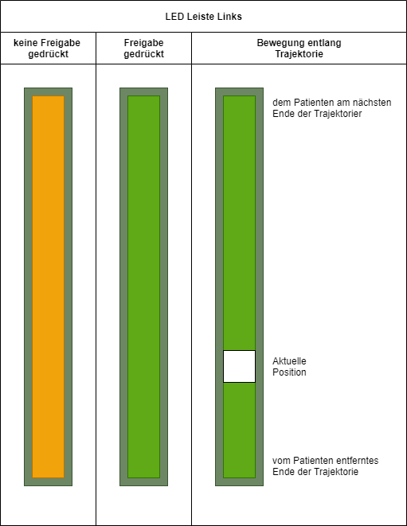
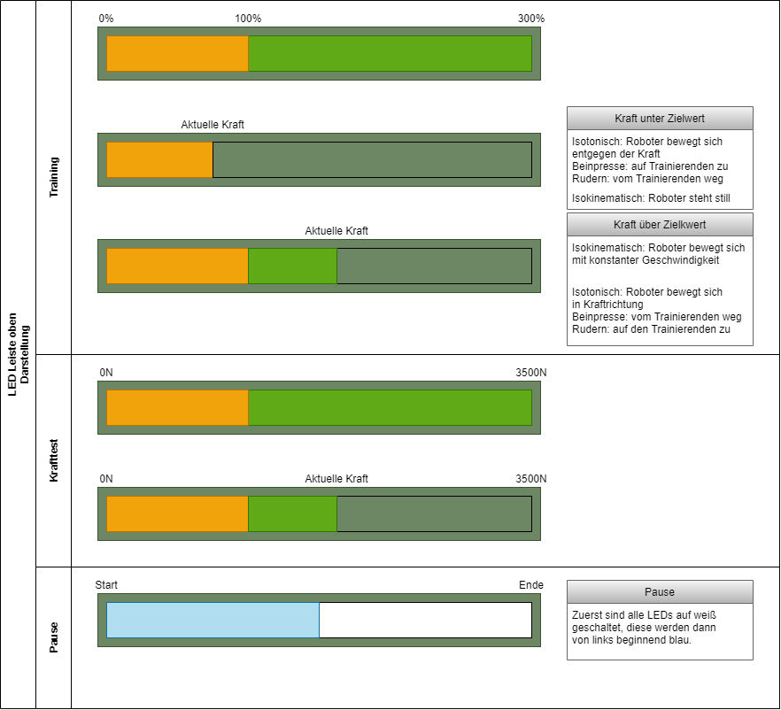
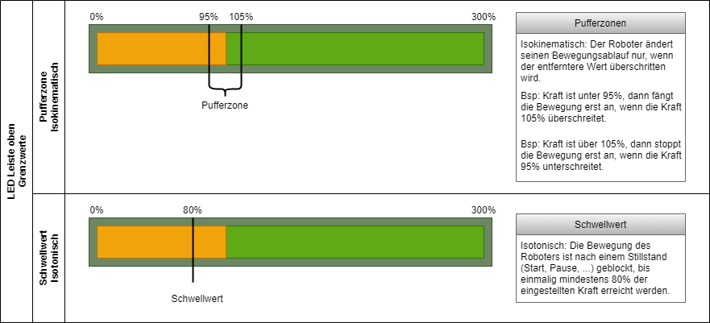

# LEDs an der Platte

## LED Leiste Links & Rechts
> [ *linke und rechte LED Leiste*](./graphics//RoboGym_LEDs-Left.png)

## LED Leiste Oben
> [ *linke und rechte LED Leiste*](./graphics//RoboGym_LEDs-Left.png)

## LED Leiste Oben
> [ *linke und rechte LED Leiste*](./graphics//RoboGym_LEDs-Left.png)

--------------------------------------------------------------------

[README](../README.md)
1. [Konfiguration](./configuration.md)
2. [Installation](./install.md)
3. [Verwendung](./operation.md)
4. [OPC-UA Server](./opc_ua.md)
5. [Details der einzelnen Trainings](./statemachines.md)
6. [LEDs](./led.md)
