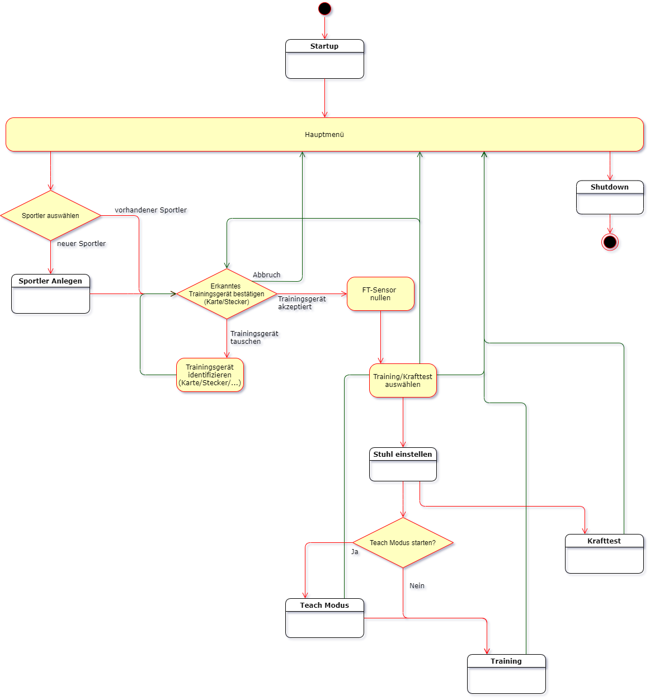
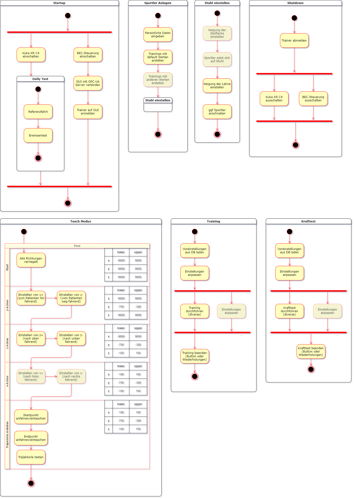

# RoboGym

> [<br>*Gesamtablauf*](./graphics/demo_modus-Full_minimalized.drawio.png)

> [<br>*Detailansichten*](./graphics/demo_modus-Details.drawio.png)

## Starten des Systems
Um das System zu starten müssen folgende Schritte durchgeführt werden:
1. Die Hauptschalter am Schaltschrank von BEC und der KR C4 von Kuka auf "ON" drehen.
2. Warten bis alle Komponenten hochgefahren sind und sich miteinander verbunden haben.
3. Drücken des Freigabetasters des Trainers um die Steuerung des Roboters frei zu geben.
4. In den Modus "T1" wechseln
	- Auf der KCP wird der Schlüssel gedreht.
	- In der Auswahl auf "T1" drücken.
	- Danach wieder den Schlüssel drehen.
5. Nun muss der Täglich QA Test durchgeführt werden.
	- Abwhälen eines aktiven Programms
		- oben auf "R" drücken
		- auf "Programm abwählen" drücken
	- im Navigator auf "QA_TEST" drücken
	- am unteren Bildschirmrand auf "anwählen" drücken
	- Die Freigabetaste auf der Rückseite und den Play Button auf der linken Seite zeitgleich gedrückt halten.
	- An manchen Stellen des Programms muss noch der Play Button kurz losgelassen und wieder gedrückt werden.
	- OPTIONAL: Aktuell muss noch der Positionssensor überlistet werden, indem man zeitgleich zum Roboter die schwarze "Referenzgabel" an den Referenzsensor hebt und wieder wegnimmt.
6. Wenn entweder die Justagerefenz und/oder der Bremsentest nicht erfolgreich waren, muss Schritt 5 wiederholt werden.
7. Jetzt den Modus wieder auf "EXT" stellen.
	- Zuerst den Schlüssel drehen.
	- In der Auswahl auf "EXT" drücken.
	- Dann den Schlüssel wieder drehen.
8. Die restliche Steuerung kann über die GUI erfolgen.

Das restliche System startet durch die eingerichtete Services automatisch. Das Einrichten der Services ist [hier](./install.md) zu finden.

## GUI
1. Auf der GUI anmelden
2. Oben auf den Würfel und dann auf speichern klicken. (Dies verbindet die GUI mit dem OPC-UA Server)
3. Einen Trainierenden auswählen
4. Auf "Control Stationary" klicken.
5. Entweder eine neue Trajektorie einteachen, oder ein Training starten.

## Monitoring des Systems
Die Services, in denen die Exacontrol Komponenten gestartet wurden, können mit "systemctl" und "journalctl" beobachtet werden. Um dies zu vereinfachen, gibt es die Möglichkeit mit dem Script "/script/RoboGym_Monitor.sh" ein geteiltes Terminal zu starten, welches alle vier Module zeitgleich anzeigt.

Alle Angaben gelten für mehrere Services und müssen meist einzeln ausgeführt werden. Die Services im Einzelnen sind:
- RoboGym_ExaCore.service
- RoboGym_Fieldbus.service
- RoboGym_OPCUA.service
- RoboGym_Robot.service

1. Manuelles beobachten:
	- ```systemctl status RoboGym_ExaCore.service``` zeigt den status des Service an
		- unter "Active" wird angegeben ob der Service noch läuft und wann er das letzte mal gestartet wurde
		- unter "Main PID" bzw. "CGroup" werden die PIDs der Processe aufgelistet
		- am Ende werden die letzten Ausgaben von "cout" und "cerr" noch mit Zeitstempeln angegeben.
	- ```journalctl -f -u RoboGym_ExaCore.service``` gibt nur die Ausgaben von "cout" und "cerr" an, kann diese jedoch besser filtern
2. Automatisiertes beobachten:
	- Das Script "/scripts/RoboGym_Monitor.sh" verwendet Terminator um vier Terminals zeigleich darzustellen und ruft in jedem Terminal eine gefilterte Ausgabe von journalctl auf:
		- [lo] ```journalctl -f -a --no-tail -u RoboGym-Fieldbus.service --output=cat```
		- [lu] ```journalctl -f -a --no-tail -u RoboGym-Robot.service --output=cat```
		- [ro] ```journalctl -f -a --no-tail -u RoboGym-ExaCore.service --output=cat```
		- [ru] ```journalctl -f -a --no-tail -u RoboGym-OPCUA.service --output=cat```
	- Das Script "/scripts/RoboGym_startInEclipse.sh" beendet die Services und startet die IDE Eclipse, in der das System dann gestartet werden kann.

## Modifizieren des Systems
### Starten der IDE
Wenn man Änderungen am System vornehmen möchte muss das System in Eclipse gestartet werden. Damit die Module aus den Services nicht mit denen aus Eclipse konkurrieren, müssen diese beendet werden. Dies kann entweder manuell mit ```sudo systemctl stop RoboGym_ExaCore.service``` erfolgen, oder mithilfe des Scripts "/scripts/RoboGym_startInEclipse.sh"

Innerhalb von Eclipse gibt es dann zweit C++ Ansichten in der rechten oberen Ecke.
1. Die Standardansicht für C++ in der man eine Übersicht über die Projekte und Dateien hat, sowie einen Editor um diese zu Veränder.
2. Eine Ansicht mit vier Terminals um die vier Exacontrol Komponenten zeitgleich im Blick zu behalten. Nachdem eine Komponente gestartet wurde, kann diese an ein offenes Terminal "gepinnt" werden, wodurch dieses Terminal nicht mehr bei jeder Aktivität den Fokus ändert.

### Übernehmen der Änderungen
Um die ausführbaren Dateien in den richtigen Ordner zu kopieren, kann das Script "/scripts/RoboGym_Update.sh" verwendet werden. Dieses erzeugt ein Backup der aktuellen Executables in einem Ordner mit dem aktuellen Timestamp und erstellt eine neue Umgebung mit den Executables aus dem Eclipse-Workspace. Dabei werden auch die Configurationsdateien für Exacontrol neu kopiert.

Wenn ein manuelles Kopieren erwünscht ist, müssen die Dateien aus ```/home/developer/eclilpse-workspace_robogym/``` nach ```/home/exacontrol/scrips/``` kopiert werden. Dabei werden folgende Umbenennungen nötig:
- ```/home/developer/eclilpse-workspace_robogym/ExacontrolCore/Debug/ExacontrolCore``` &rarr; ```/home/exacontrol/scrips/ExacontrolCore/ExacontrolCore```
- ```/home/developer/eclilpse-workspace_robogym/FieldBusAdapter/Debug/FieldBusAdapter``` &rarr; ```/home/exacontrol/scrips/FieldBusModule/FieldBusModule```
- ```/home/developer/eclilpse-workspace_robogym/RobotAdapter/Debug/RobotAdapter``` &rarr; ```/home/exacontrol/scrips/RobotModule/RobotModule```
- ```/home/developer/eclilpse-workspace_robogym/OpcUaModul/Debug/OpcUaModul``` &rarr; ```/home/exacontrol/scrips/OpcUaModule/OpcUaModule```

Die ".cfg" Dateien dürfen dabei nicht umbenannt werden. Mit einem späteren Upgrade auf die aktuelle Version von Exacontrol dürfte sich die umbenennung erledigt haben.

--------------------------------------------------------------------

[README](../README.md)
1. [Konfiguration](./configuration.md)
2. [Installation](./install.md)
3. [Verwendung](./operation.md)
4. [OPC-UA Server](./opc_ua.md)
5. [Details der einzelnen Trainings](./statemachines.md)
6. [LEDs](./led.md)
