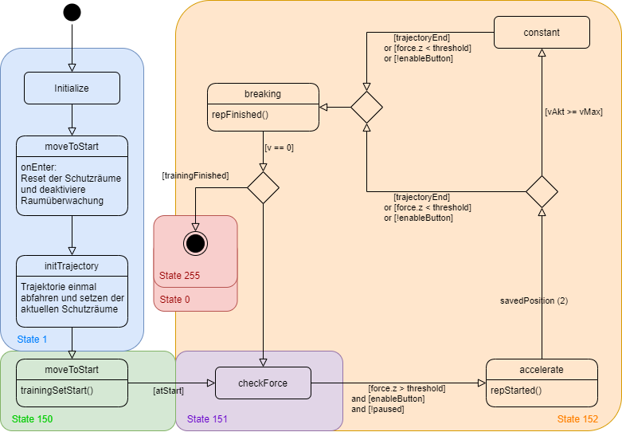
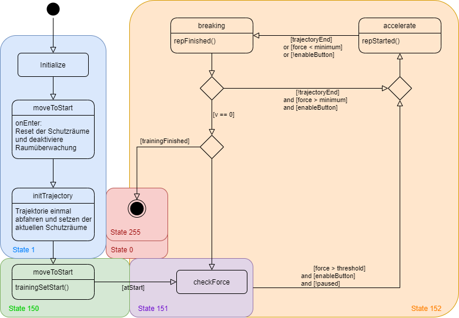
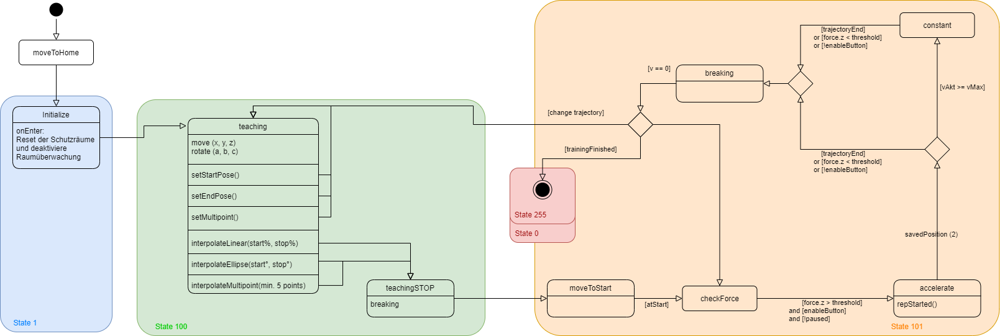
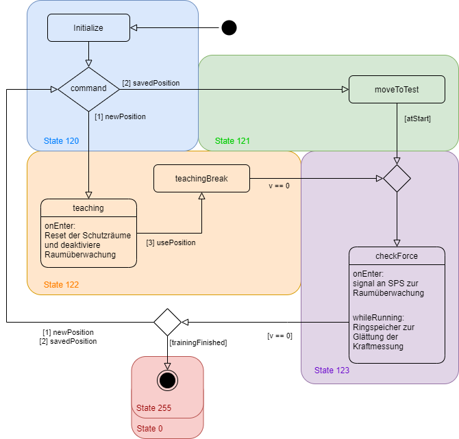

# Statemachines

## Isokinematic Mode
Der isokniematische Modus stellt eine Bewegung mit konstanter Geschwindigkeit dar.
> [ *Isokinematisches Training*](./graphics/RoboGym_StateMachine_Isokinematic.png)

1. 

State 1: Init 

Zuerst wird der Roboter auf die Anfangsposition der Trajektorie verfahren, und ein Signal an die SPS geschickt, um die Sicherheitsräume zu entsperren.
Dann wird die Trajektorie abgefahren und am nächsten Punkt zum Stuhl ein Signal an die SPS gesendet, um abhängig von der Position die Sicherheitsräume aktiv zu setzen.

2. 

State 150: Move to Start 

Fährt den Roboter wieder auf die Startposition der Trajektorie.

3. 

State 151: Wait for force 

Wartet auf genügend Kraft (f_target), um los fahren zu dürfen.

3. 

State 152: Moving 

So lange die Kraft über dem Schwellwert (f_target) bewegt sich der Roboter mit konstanter Geschwindigkeit (v_target) auf der Trajektorie.

3. 

State 255|0: Finished 

Wenn die Anzahl an Wiederholungen und Trainings-Sets auf 0 fällt, oder das Stop-Signal vom OPC-UA Server kommen wird der Roboter angehalten und bei einer Geschwindigkeit von ~0 m/s wird der Workflow beendet.

## Isotonic Mode
Der isotonische Modus imitiert ein Gewicht, welches entlang der Trajektorie bewegt wird.
> [ *Isotonisches Training*](./graphics/RoboGym_StateMachine_Isotonic.png)

1. 

State 1: Init 

Zuerst wird der Roboter auf die Anfangsposition der Trajektorie verfahren, und ein Signal an die SPS geschickt, um die Sicherheitsräume zu entsperren.
Dann wird die Trajektorie abgefahren und am nächsten Punkt zum Stuhl ein Signal an die SPS gesendet, um abhängig von der Position die Sicherheitsräume aktiv zu setzen.

2. 

State 150: Move to Start 

Fährt den Roboter wieder auf die Startposition der Trajektorie.

3. 

State 151: Wait for force 

Wartet auf genügend Kraft (0.8*f_target), um los fahren zu dürfen.

4. 

State 152: Moving 

Wenn die Kraft unter dem eingestellten Schwellwert (f_target) ist, beschleunigt der Roboter in Richtung des Trainierenden. Wenn die Kraft über dem Schwellwert ist, beschleunigt der Roboter weg vom Trainierenden.

5. 

State 255|0: Finished 

Wenn die Anzahl an Wiederholungen und Trainings-Sets auf 0 fällt, oder das Stop-Signal vom OPC-UA Server kommen wird der Roboter angehalten und bei einer Geschwindigkeit von ~0 m/s wird der Workflow beendet.

## Teaching Mode
Der Teaching Modus ist dazu gedacht, eine neue Trajektorie einzustellen und stellt dafür 2 Möglichkeiten der Bewegung zur Verfügung.
1. Bewegung über den Kraftsensor
2. Bewegung mit dem Freigabetaster des Trainers und den Pfeiltasten an der Platte. (Die Werte des Kraftsensors werden hierbei ignoriert.)

> [ *Teaching Modus*](./graphics/RoboGym_StateMachine_Teaching-bisher.png)

1. 

State 1: Init 

Zuerst wird der Roboter auf die Home Position (auf dem Roboter/KCP gespeichert) verfahren, und ein Signal an die SPS geschickt, um die Sicherheitsräume zu entsperren.

2. 

State 100: Teaching 

Wartet auf genügend Kraft an der Platte oder betätigung von Trainer-Freigabetaste und Pfeiltaste.
Es können über die GUI der Start und Endpunkt einer Trajektorie gespeichert und dann die Trajektorie dazwischen interpoliert werden.
Bei der Verwendung der Tasten wird wie folgt verfahren:

	- <kbd>&larr;</kbd> Fahrt in negativer y-Richtung (weg vom Stuhl)
	- <kbd>&rarr;</kbd> Fahrt in positiver y-Richtung (zum Stuhl hin)
	- <kbd>&uarr;</kbd> Fahrt in positiver z-Richtung (nach oben)
	- <kbd>&darr;</kbd> Fahrt in negativer z-Richtung (nach unten)
	- <kbd>&larr;</kbd> + <kbd>&uarr;</kbd> Rotation um die x-Achse negativ (nach vorne kippen)
	- <kbd>&larr;</kbd> + <kbd>&darr;</kbd> Rotation um die x-Achse positiv (nach hinten kippen)
	- <kbd>&rarr;</kbd> + <kbd>&uarr;</kbd> Fahrt in positiver x-Richtung (nach links)
	- <kbd>&rarr;</kbd> + <kbd>&darr;</kbd> Fahrt in negativer x-Richtung (nach rechts)

3. 

State 101: Trajectory testing 

Verwendet die isokinematische Bewegung, um ein Testen der Trajektorie zu ermöglichen.

4. 

State 255|0: Finished 

Wenn die Anzahl an Wiederholungen und Trainings-Sets auf 0 fällt, oder das Stop-Signal vom OPC-UA Server kommen wird der Roboter angehalten und bei einer Geschwindigkeit von ~0 m/s wird der Workflow beendet.

## Force Test Mode
Beim Kraft-Test kann entweder mit der Teaching-Bewegung eine neue Position angefahren werden, oder es wird ein gespeicherter Punkt aus dem OPC-UA Server angefahren (teaching_position). Danach wird einfach nur die aktuelle Kraft gemittelt und der Maximalwert ausgegeben. (Auf dem OPC-UA Server, noch nicht auf der GUI.)

> [ *Kraft Test Modus*](./graphics/RoboGym_StateMachine_ForceTest-aktuell.png)

--------------------------------------------------------------------

[README](../README.md)
1. [Konfiguration](./configuration.md)
2. [Installation](./install.md)
3. [Verwendung](./operation.md)
4. [OPC-UA Server](./opc_ua.md)
5. [Details der einzelnen Trainings](./statemachines.md)
6. [LEDs](./led.md)
